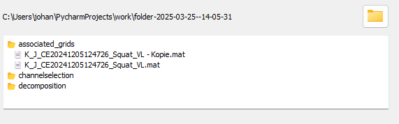

<div align="center">
<br>
  <br>
    <h2 align="center">🧠 hdsemg-pipe</h2>
    <h3 align="center">HDsEMG Workflow Manager</h3>
</div>

A modular GUI application to guide users through high-density surface EMG (HDsEMG) processing, from raw signal acquisition to motor unit decomposition.

<div align="center">
  
</div>


---

## 📚 Table of Contents

- [Overview](#-overview)
- [Features](#-features)
- [Installation](#-installation)
- [Usage Workflow](#-usage-workflow)
  - [📁 Step 1: Load Files](#-step-1-load-files)
  - [🔗 Step 2: Grid Association](#-step-2-grid-association)
  - [👓 Step 3: Define Region of Interest](#-step-3-define-region-of-interest)
  - [🧼 Step 4: Channel Cleaning](#-step-4-channel-cleaning)
  - [🧬 Step 5: Decomposition](#-step-5-decomposition)
- [🔧 Settings](#-settings)
- [📂 Folder Structure](#-folder-structure)
- [🔗 Related Tools](#-related-tools)

---

## 🔍 Overview

The hdsemg-pipe is a central application within the hdsemg-toolbox, designed to streamline and partially automate the following stages:

- HDsEMG data loading and management  
- Grid association and virtual grid construction  
- Channel selection and cleaning  
- Motor unit decomposition

All metadata are stored alongside standard formats such as `.json`, `.pkl`, and `.mat` to ensure compatibility with existing tools such as [openhdemg](https://github.com/GiacomoValliPhD/openhdemg).

---

## ✨ Features

- 📂 Load and manage multiple `.mat` HDsEMG files
- 🔗 Associate files to form virtual grids
- 🧼 Interface with the [hdsemg-select App](https://github.com/johanneskasser/hdsemg-pipe.git) for channel cleaning
- 🧬 Record decomposed motor unit data with linked metadata
- 💾 Save all results in a structured working directory

---

## 🛠️ Installation

  ```bash
  git clone https://github.com/johanneskasser/hdsemg-pipe.git
  ```

### (Optional) Create a virtual environment:
  ```bash
  python -m venv venv
  source venv/bin/activate  # On Windows use: venv\Scripts\activate
  ```

### Install dependencies:
  ```bash
  pip install -r requirements.txt
  ```

### (Alternative) Set up with Conda:

If you prefer using Conda for environment management, run the following:

  ```bash
  conda env create -f environment.yml
  conda activate hdsemg-pipe
  ```

### Compile the resource file:
  ```bash
  cd ./src
  pyrcc5 resources.qrc -o resources_rc.py
  ```

### Run the application:
  ```bash
  python src/main.py
  ```

---

## 🚀 Usage Workflow

### 📁 Step 1: Load Files

- Open one or multiple `.mat` files or folders containing HDsEMG recordings.
- The app will create a working directory based on your **Settings** path and prepare subfolders for processing stages:
  - `original_files/`
  - `associated_grids/`
  - `channelselection/`
  - `decomposition/`
  - `cropped_signal/`
- When a folder or file is selected, it performs a preprocessing step which
  - Performs a offset correction of the emg signals in the file (Removes the mean value of the signal so the signal oscillates around 0)
  - These corrected signals are saved in the `original_files/` folder
📸 Example:  

<div align="center">
  
</div>

---

### 🔗 Step 2: Grid Association

Combine grids across multiple files to form a **virtual electrode grid**.

- Associate grids (e.g., 4x3 from File A + 4x5 from File B → 4x8)
- Save result as `.mat` with origin info stored in `.json`
- Optionally skip this step

📸 Example:
<div align="center">
  
</div>

---

### 👓 Step 3: Define Region of Interest

This step allows Users to select a Region of Interest for the data. Therefore, a Dialog is opened which will show the reference signals
of the grids and select the region of interest. The selected region will be saved in the `cropped_signal/` folder.

- **Interactive ROI Definition 🎚️:**  
  - Use a RangeSlider on the x-axis to set ROI boundaries.
  - Vertical lines update in real time to show thresholds.

- **Data Saving 💾:**  
  - Save the sliced ROI data (signal, time vector, metadata) to .mat files.

📸 Example:
<div align="center">
  
</div>

### 🧼 Step 4: Channel Cleaning

Integrates the [hdsemg-select App](https://github.com/johanneskasser/hdsemg-select.git) for semi-automated channel selection:

- Launches selection GUI with the correct file
- Automatically stores cleaned result
- Iterates through all virtual grids
- Requires path to the external hdsemg-select executable to be set in **Settings**

---

### 🧬 Step 5: Decomposition

After cleaning, the user can:

- Use their own decomposition tools
- Store results in the `decomposition/` folder
- Assign the decomposed file to its corresponding cleaned data file via a GUI dialog
- Metadata from all previous steps will be embedded into `.json`, `.pkl`, or `.mat` files under an `"EXTRAS"` field

---

## 🔧 Settings

The app is configurable through the Settings Dialog accessible from the top menu:

- 📁 Working directory path
- 📍 Path to external hdsemg-select executable
- 🚀 Path to the openhdemg executable

<div align="center">
  
</div>

---

## 📂 Folder Structure

```
working_directory/
├── original_files/
│   └── original_file_1..n.mat
├── associated_grids/
│   └── [virtual_grid_files].mat + [virtual_grid_files].json
├── cropped_signal/
│   └── cropped_signals.mat
├── channelselection/
│   └── [cleaned_channels].mat + [cleaned_channels].json
├── decomposition/
│   └── [final_results].mat + embedded metadata
```

---

## 🔗 Related Tools

- [hdsemg-select App 🧼](https://github.com/johanneskasser/hdsemg-select.git)
- [openhdemg 🧬](https://github.com/GiacomoValliPhD/openhdemg)

---

## 📣 Contributions

Pull requests, suggestions and ideas are welcome. If you encounter bugs or want to propose new features, please open an [issue](https://github.com/johanneskasser/hdsemg-pipe.git/issues).

---