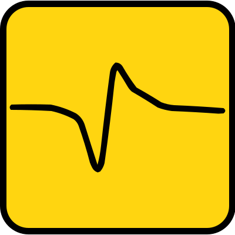

<div align="center">
<br>
  <br>
    <h2 align="center">🧠 hdsemg-pipe</h2>
    <h3 align="center">HDsEMG Workflow Manager</h3>
</div>

hdsemg-pipe is a Python-based application for processing HD-sEMG (High-Density Surface Electromyography) data. It provides a user-friendly interface for managing and analyzing HD-sEMG recordings.

## Documentation

The full documentation for hdsemg-pipe is available at:

📚 **[Usage Documentation](https://johanneskasser.github.io/hdsemg-pipe/)**

This includes detailed guides on installation, usage, and contributing to the project.

## Installation

In order to install hdsemg-pipe, follow the instructions in the [installation guide](https://johanneskasser.github.io/hdsemg-pipe/latest/installation/).

### Quick Installation

#### Installation from PyPi

1. Available as a Python package and can be installed via pip:

```bash
  pip install hdsemg-pipe
```

2. After the installation, you can run the application from the command line:

```bash
  python -m hdsemg_pipe.main
```

#### Installation from source

1. Create a virtual environment (recommended):

```bash
    # Create a virtual environment
    python -m venv venv
    
    # Activate the virtual environment
    # On Windows:
    venv\Scripts\activate
    # On Unix or MacOS:
    source venv/bin/activate

    # install Dependencies
    pip install -r requirements.txt

    # Compile the QT Resources 
    cd ./hdsemg_pipe
    pyrcc5 resources.qrc -o resources_rc.py
    
```

## Features

- 📁 File management and preprocessing
- 🔗 Grid association and ROI definition
- 🎚️ Channel selection and decomposition result visualization
- ⚡️ Integration with external tools like
  - [openhdemg](https://github.com/GiacomoValliPhD/openhdemg)
  - [Swarm Contrastive Decomposition](https://github.com/AgneGris/swarm-contrastive-decomposition)
  - [SCD Edition](https://github.com/AgneGris/scd-edition)
  - [MUedit](https://github.com/simonavrillon/MUedit)

## Acknowledgments

This project is beeing developed with support from:

**[Hochschule Campus Wien](https://www.hcw.ac.at)**
Department of Physiotherapy

Supervised by **Dr. rer. nat. Harald Penasso** ([harald.penasso@hcw.ac.at](mailto:harald.penasso@hcw.ac.at))
