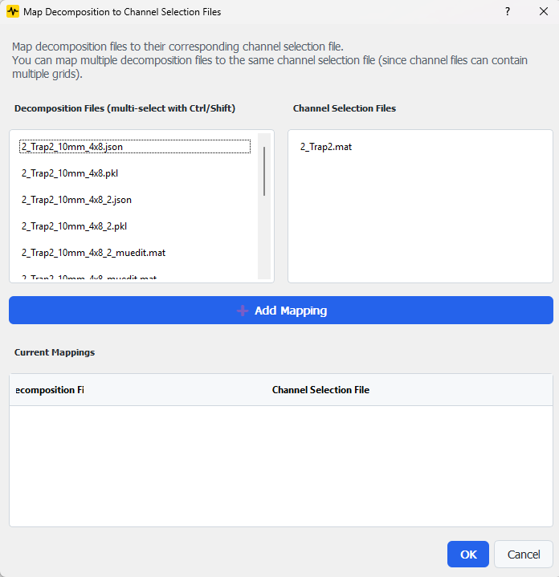

# Decomposition Results

The Decomposition Results step provides tools for processing, manually cleaning, and visualizing motor unit decomposition results. It supports both automated visualization and manual quality control workflows using MUEdit.

## Overview

This step provides three main workflows:

1. **File Mapping**: Associate decomposition results with their source channel selection files
2. **Manual Cleaning**: Export results to MUEdit format for manual inspection and editing
3. **Visualization**: View processed results in OpenHD-EMG

## Interface Components

### Main Buttons

- **Apply Mapping**: Opens a dialog to create mappings between decomposition and channel selection files
- **Export to MUEdit**: Converts OpenHD-EMG JSON files to MUEdit MAT format
- **Open MUEdit**: Launches MUEdit for manual cleaning of decomposition results
- **Show Decomposition Results**: Launches OpenHD-EMG to visualize the processed results

### File Watcher

The system automatically monitors the decomposition folder for:
- `.json` files (OpenHD-EMG decomposition results)
- `.pkl` files (pickle format decomposition results)
- `*_muedit.mat` files (exported for manual cleaning)
- Edited result files (saved from MUEdit)

Buttons are automatically enabled/disabled based on detected file types.

## Mapping Process

### Opening the Mapping Dialog

The mapping dialog provides a user-friendly interface to create 1:1 mappings between:
- Decomposition result files (`.json`, `.pkl`)
- Channel selection files (`.mat`)



### Dialog Components

- **Left List**: Shows available decomposition files
- **Right List**: Shows available channel selection files
- **Add Mapping Button**: Creates a mapping between selected files
- **Mapping Table**: Displays current mappings
- **OK/Cancel Buttons**: Confirm or discard mappings

### Creating Mappings

1. Select a decomposition file from the left list
2. Select a corresponding channel selection file from the right list
3. Click "Add Mapping" to create the association
4. The mapping appears in the table below
5. Repeat for all required files
6. Click OK to save mappings

### Validation Rules

- Each decomposition file can only be mapped once
- Each channel selection file can only be mapped once
- Both files must be selected to create a mapping
- Existing mappings are preserved and can be extended

## File Processing

### Automatic Processing

When mappings are confirmed:
1. Each decomposition file is processed with its corresponding channel selection
2. The system updates metadata in the result files
3. Progress is tracked and displayed

### File Types

The system handles different file formats:
- `.pkl` files: Updated using `update_extras_in_pickle_file`
- `.json` files: Updated using `update_extras_in_json_file`

### Error Handling

The system provides feedback for common issues:
- Missing files
- Processing errors
- Invalid mappings
- File access problems

## Manual Cleaning Workflow (MUEdit)

The application provides integrated support for manual quality control of decomposition results using MUEdit, a MATLAB-based tool for visual inspection and editing of motor unit decompositions.

**MUEdit Repository:** [https://github.com/haripen/MUedit/tree/devHP](https://github.com/haripen/MUedit/tree/devHP)

### Workflow Overview

The manual cleaning workflow consists of three stages:

1. **Export**: Convert OpenHD-EMG JSON files to MUEdit MAT format
2. **Edit**: Manually inspect and clean results in MUEdit
3. **Track**: Monitor progress as files are processed

### Stage 1: Export to MUEdit Format

#### File Format Requirements

The application expects decomposition results in one of the following formats:

- **OpenHD-EMG JSON format** (`.json`): Standard output from OpenHD-EMG decomposition
- **MUEdit MAT format** (`*_muedit.mat`): Ready for loading into MUEdit

The pipeline automatically detects which format your files are in.

#### Exporting JSON Files

If you have OpenHD-EMG JSON files:

1. Click **"Export to MUEdit"** button
2. The system converts each `.json` file to `*_muedit.mat` format
3. Export progress is displayed with success/error counts
4. Files already exported are automatically skipped

**What happens during export:**
- Raw EMG signal data is extracted and transposed
- Motor unit pulse trains are normalized
- Discharge times are converted to 1-indexed MATLAB format
- Grid information and metadata are preserved
- Files are saved with MATLAB compression

**Button behavior:**
- Enabled when JSON files without corresponding `*_muedit.mat` files are detected
- Disabled when all JSON files already have MUEdit exports

### Stage 2: Launch MUEdit

#### Configuration (Settings)

Before launching MUEdit, configure the integration in **Settings > MUEdit Configuration**:

**MUEdit Installation Path:**
- Specify the folder containing MUEdit MATLAB files (e.g., `MUedit_exported.m`)
- This path is added to MATLAB's search path when launching
- The application checks if the path is already present to avoid duplicates

**Launch Method:**
- **AUTO** (recommended): Automatically tries all available methods
- **MATLAB Engine API**: Reuses existing MATLAB sessions (requires `pip install matlabengine`)
- **MATLAB CLI**: Starts a new MATLAB process (requires MATLAB in PATH)
- **Standalone**: Launches MUEdit as a standalone executable

#### Launching MUEdit

1. Click **"Open MUEdit"** button (enabled when `*_muedit.mat` files are detected)
2. The application attempts to launch MUEdit using the configured method
3. An instruction dialog appears with workflow guidance

**Launch methods tried in AUTO mode:**
1. MATLAB Engine (best - reuses session, avoids repeated path additions)
2. MATLAB CLI (starts new session with path check)
3. Standalone (executable mode)

**Path Management:**
- MATLAB Engine: Checks current MATLAB path before adding MUEdit path
- MATLAB CLI: Uses `contains(path, ...)` to avoid duplicate path entries
- Prevents accumulation of duplicate paths across multiple launches

### Stage 3: Instruction Dialog & Live Tracking

When MUEdit launches, an interactive instruction dialog guides you through the workflow.

#### Dialog Features

**Step-by-Step Instructions:**
1. Load the highlighted file in MUEdit
2. Review and manually clean the motor unit decomposition
3. Save the file in MUEdit
4. Progress updates automatically when you save
5. Repeat for all remaining files

**Live Progress Tracking:**
- **File Status List**: Shows all files with ✅ (completed) or ⏳ (pending) status
- **Next File to Edit**: Highlights the next file that needs processing
- **Copyable Path**: One-click copy of the full file path for easy loading
- **Live Indicator**: Blinks to show the dialog is monitoring for changes
- **Auto-Update**: Refreshes every 2 seconds to detect newly saved files

#### Progress Detection

The application automatically detects when you save edited files:

- Monitors the decomposition folder for new `.mat` files
- Recognizes edited files based on the base filename
- Flexible naming: any `.mat` file containing the base name is detected as edited
- Visual/audio feedback when a file is completed
- Progress percentage updates in real-time

**Example file flow:**
```
Original:     filename.json
Exported:     filename_muedit.mat      (ready for editing)
Edited:       filename_*.mat           (saved from MUEdit, detected automatically)
```

**Note:** The exact naming of edited files may vary depending on your MUEdit version. The pipeline automatically detects any `.mat` file that matches the base filename.

#### Completion

When all files are cleaned:
- Dialog shows "🎉 All files have been cleaned!"
- Progress bar reaches 100%
- Success message displayed

## Result Visualization

### OpenHD-EMG Integration

To view results:
1. Click "Show Decomposition Results"
2. The system launches OpenHD-EMG application
3. Results are automatically loaded
4. The button shows a loading animation during startup

### Requirements

- OpenHD-EMG virtual environment must be configured in Settings
- The path must be valid and accessible
- Python environment must include required dependencies

## Configuration

### Required Settings

In the application settings:
```
Settings > OpenHD-EMG Virtual Environment Path
```

### File Paths

The system uses several important paths:
- Decomposition results folder
- Channel selection folder
- OpenHD-EMG virtual environment

## Best Practices

1. **Before Processing**
   - Ensure all decomposition results are available
   - Verify channel selection files are in place
   - Check OpenHD-EMG configuration
   - Configure MUEdit settings if planning manual workflow

2. **During Mapping**
   - Create mappings systematically
   - Verify mappings before confirming
   - Monitor processing progress

3. **Manual Cleaning Workflow**
   - **Recommended**: Install MATLAB Engine API (`pip install matlabengine`) for best performance
   - Configure MUEdit path in Settings before first use
   - Export all files before starting manual cleaning
   - Keep the instruction dialog open while working in MUEdit
   - Save files in MUEdit after each edit to trigger progress tracking
   - Work sequentially through files using the "Next File" guidance

4. **Viewing Results**
   - Wait for processing to complete
   - Ensure OpenHD-EMG launches successfully
   - Check for any error messages

## Troubleshooting

### Common Issues

1. **Missing Files**
   - Verify decomposition results are in the correct folder
   - Check channel selection files are available
   - Ensure file permissions are correct

2. **OpenHD-EMG Issues**
   - Verify virtual environment path
   - Check Python dependencies
   - Monitor application logs

3. **Processing Errors**
   - Check file format compatibility
   - Verify file contents
   - Review error messages in application logs

4. **MUEdit Launch Issues**
   - **"MATLAB Engine API not available"**: Install with `pip install matlabengine`
   - **"MATLAB executable not found in PATH"**: Add MATLAB to system PATH or use Engine mode
   - **"Failed to launch using any available method"**:
     - Check MATLAB installation
     - Verify MUEdit path in Settings
     - Try manual MATLAB launch and then use Engine mode
   - **"MUEdit path not set"**: Configure in Settings > MUEdit Configuration

5. **Export Issues**
   - **"No JSON files found"**: Only `.json` files can be exported to MUEdit format
   - **"openhdemg library not available"**: Install OpenHD-EMG via Settings
   - **Export button disabled**: All JSON files already have `*_muedit.mat` exports

6. **Progress Tracking Issues**
   - **Files not detected after saving**: Check file naming contains the base filename
   - **Live indicator not updating**: Dialog auto-refreshes every 2 seconds, wait briefly
   - **Edited file not recognized**: Ensure the saved `.mat` file contains the original base name

### Error Messages

Common error messages and solutions:

- "OpenHD-EMG virtual environment path is not set"
  - Configure the path in Settings
  - Verify the environment exists

- "The decomposition folder does not exist"
  - Check folder structure
  - Verify workspace configuration
  - Ensure previous steps completed successfully

- "MATLAB Engine API not available"
  - Install MATLAB Engine: `pip install matlabengine`
  - Or switch to CLI/Standalone mode in Settings

- "Failed to launch via MATLAB Engine/CLI/Standalone"
  - AUTO mode will try all methods sequentially
  - Check specific launch method configuration
  - Verify MATLAB installation and PATH

## Next Steps

After completing this step:

### If Using Manual Cleaning Workflow:
1. Verify all files are exported to MUEdit format
2. Complete manual cleaning of all files in MUEdit
3. Confirm all files show ✅ status in the progress dialog
4. View cleaned results in OpenHD-EMG

### If Using Direct Visualization:
1. Verify all mappings are processed
2. Check results in OpenHD-EMG
3. Export or save final results as needed

### Additional Resources
- [MUEdit GitHub Repository](https://github.com/haripen/MUedit/tree/devHP)
- OpenHD-EMG Documentation
- Application logs for detailed troubleshooting
