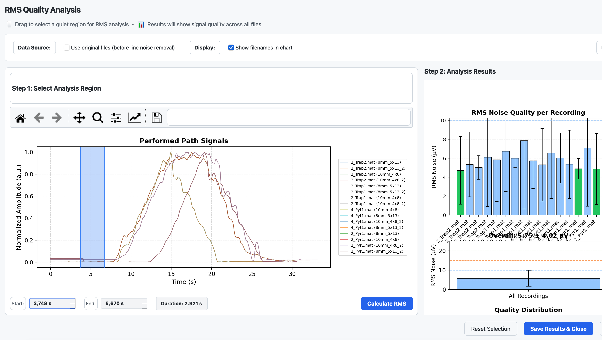

# RMS Quality Analysis

The RMS Quality Analysis step allows you to assess signal quality across all your HD-sEMG recordings by analyzing baseline noise levels. This step comes after Line Noise Removal and helps you identify recordings with poor signal quality before proceeding to decomposition.



## Overview

In this step, you can:
1. Visualize performed path signals from all recordings
2. Select a quiet region (e.g., rest period) for analysis
3. Calculate RMS noise levels for all EMG channels
4. View quality statistics and visualizations
5. Save comprehensive analysis reports

## Why Analyze RMS Noise?

Root Mean Square (RMS) noise analysis is a fundamental quality assessment for EMG signals:

- **Baseline Noise Assessment**: Identifies recordings with excessive noise that may affect decomposition
- **Quality Comparison**: Allows comparison between recordings to identify outliers
- **Data Selection**: Helps decide which recordings to include in further analysis
- **Equipment Verification**: Can reveal electrode contact issues or amplifier problems

## Quality Thresholds

The analysis uses established thresholds to classify signal quality:

| Category | RMS Range (µV) | Color | Interpretation |
|----------|----------------|-------|----------------|
| **Excellent** | ≤5 | Green | Ideal signal quality |
| **Good** | 5–10 | Light Blue | Acceptable for most analyses |
| **OK** | 10–15 | Orange | Marginal quality, use with caution |
| **Troubled** | 15–20 | Magenta | Poor quality, may affect results |
| **Bad** | >20 | Red | Significant noise, consider excluding |

## Interface Components

### Options Panel

At the top of the dialog:

- **Data Source**: Toggle between:
  - `Use original files (before line noise removal)` - Compare cleaned vs uncleaned signals
  - Default: Uses line-noise-cleaned files

- **Display Options**:
  - `Show filenames in chart` - Toggle between showing full filenames or numeric indices

- **File Count**: Shows the number of files available for analysis

### Step 1: Select Analysis Region

The left panel contains the signal selection plot:

- **Signal Plot**: Overlaid performed path signals from all recordings
  - Signals are normalized to [0, 1] for visualization
  - Color-coded by file with legend

- **Navigation Toolbar**: Matplotlib controls for zooming and panning

- **Selection Methods**:
  - **Drag Selection**: Click and drag to select a region (recommended)
  - **Two-Click Selection**: Click twice to define start and end points
  - **Manual Entry**: Type exact values in the Start/End spinboxes

- **ROI Display**: Shows selected region parameters:
  - Start time (editable)
  - End time (editable)
  - Duration (read-only)

- **Calculate RMS**: Process the selected region

### Step 2: Analysis Results

The right panel displays analysis results:

- **Panel A: Per-Recording Bar Chart**
  - Mean RMS per file with error bars (standard deviation)
  - Color-coded by quality category
  - Dashed threshold lines for reference

- **Panel B: Overall Statistics**
  - Grand mean with error bar across all recordings
  - Single bar showing aggregate quality

- **Panel C: Quality Distribution**
  - Pie chart showing percentage of channels in each quality category

- **Summary Box**: Text summary with:
  - Selected region details
  - File and channel counts
  - Statistical summary (mean, std, min, max)
  - Quality breakdown counts

### Action Buttons

- **Reset Selection**: Clear current selection and results
- **Save Results & Close**: Save all outputs and complete the step
- **Cancel**: Close without saving

## Workflow

### 1. Open the Analysis

1. Complete the Line Noise Removal step
2. Click "Start Analysis" on the RMS Quality Analysis step
3. The dialog opens with all performed paths overlaid

### 2. Select a Quiet Region

For accurate baseline noise assessment:

1. **Find a Rest Period**: Look for a flat region where no muscle activity occurred
2. **Select the Region**:
   - Drag across the plot, OR
   - Click twice to set boundaries, OR
   - Enter exact times manually
3. **Verify Duration**: Aim for at least 0.5–1 second of data

**Best Practices for Region Selection:**
- Avoid regions with movement artifacts
- Select during genuine rest periods
- Ensure the region exists in all recordings
- Use consistent regions when comparing studies

### 3. Calculate RMS

1. Click "Calculate RMS"
2. Wait for processing (typically fast)
3. Review the results in the right panel

### 4. Interpret Results

- **Check the bar chart**: Look for outliers with significantly higher RMS
- **Review quality distribution**: Aim for majority "excellent" or "good"
- **Note problematic files**: Consider excluding files with "bad" quality

### 5. Save and Close

1. Click "Save Results & Close"
2. Results are saved to the `analysis/` folder
3. The step is marked complete

## Output Files

When you save results, the following files are created in `{workfolder}/analysis/`:

### 1. rms_quality_summary.png

Academic-style summary figure with three panels:
- Panel A: Bar chart of mean RMS per recording with error bars
- Panel B: Grand mean across all recordings
- Panel C: Quality distribution pie chart

### 2. rms_quality_per_channel.png

Heatmap showing RMS values for every channel in every recording:
- Rows: Recordings
- Columns: Channel indices
- Color scale: Green (low noise) to Red (high noise)

### 3. rms_analysis_report.csv

Detailed CSV file with columns:
- `file_name`: Recording filename
- `grid_key`: Grid identifier
- `channel_idx`: Channel number
- `rms_uv`: RMS value in microvolts
- `quality`: Quality category
- `region_start_s`: Start of analyzed region
- `region_end_s`: End of analyzed region

### 4. rms_analysis_summary.txt

Human-readable text summary including:
- Analysis parameters
- Overall statistics
- Quality breakdown
- Per-file summaries

## Skip Option

If you don't need to analyze signal quality, you can:
1. Click "Skip"
2. The step is marked complete
3. No analysis files are generated
4. Proceed directly to the next step

## Comparing Original vs Cleaned Files

To assess the effectiveness of line noise removal:

1. Check "Use original files" in the options panel
2. Perform the analysis
3. Note the RMS values
4. Uncheck the option (use cleaned files)
5. Re-analyze the same region
6. Compare the results

Effective line noise removal should show:
- Lower mean RMS in cleaned files
- Improved quality distribution
- Smaller spread (standard deviation)

## Technical Details

### RMS Calculation

The Root Mean Square is calculated as:

```
RMS = √(mean(signal²))
```

Where the signal is extracted from the selected time region for each EMG channel.

### Unit Conversion

The analysis assumes data from OTB4 files where:
- Raw data is stored in millivolts (mV)
- Conversion factor: multiply by 1000 to get microvolts (µV)

### Channel Selection

Only EMG channels are analyzed:
- Reference channels are excluded
- Performed path and requested path signals are used only for visualization
- The analysis focuses on actual recording electrodes

## Troubleshooting

### Common Issues

1. **"No files available for analysis"**
   - Ensure Line Noise Removal step is completed
   - Check that files exist in `line_noise_cleaned/` folder

2. **"No performed path signals found"**
   - Files may not contain performed path data
   - Check file format and grid configuration

3. **Unexpectedly high RMS values**
   - Verify the selected region is actually at rest
   - Check if the region contains movement artifacts
   - Ensure proper electrode contact during recording

4. **Results differ significantly between files**
   - May indicate equipment issues during recording
   - Check electrode impedances
   - Consider excluding outlier recordings

### Interpreting Poor Quality

If many channels show poor quality:

1. **Check Recording Conditions**: Electrode contact, skin preparation
2. **Verify Line Noise Removal**: Re-run with different settings
3. **Consider Exclusion**: Remove problematic recordings from analysis
4. **Document Issues**: Note quality concerns in your analysis

## Best Practices

### Before Analysis

1. Complete line noise removal first
2. Ensure all files are properly loaded
3. Have a clear rest period in your protocol

### During Analysis

1. Select representative quiet regions
2. Use consistent region lengths across analyses
3. Compare against expected baseline levels
4. Document your region selection criteria

### After Analysis

1. Review all output files
2. Note any outlier recordings
3. Include quality metrics in your research documentation
4. Consider RMS quality when interpreting decomposition results

## References

- De Luca CJ. The use of surface electromyography in biomechanics. J Appl Biomech. 1997.
- Merletti R, Farina D. Surface Electromyography: Physiology, Engineering, and Applications. Wiley-IEEE Press, 2016.
- OT Bioelettronica. Technical specifications for HD-sEMG equipment.
